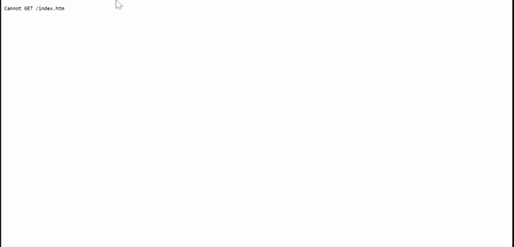

# basicwebsite
A basic web page with responsive design and some animations, inspired in youtube channel [DesignCourse](https://www.youtube.com/watch?v=QA0XpGhiz5w).

# Who to
If you using Visual Studio Code, you can install a live server plugin and use it for open de index.html in your broswer.

# How to learn
Explore de code and make some changes. Try to find:
  - colors
  - flexbox features
  - @media queries (for responsive layout)
  - @keyframes rules (for animations)
  
# Let's see

